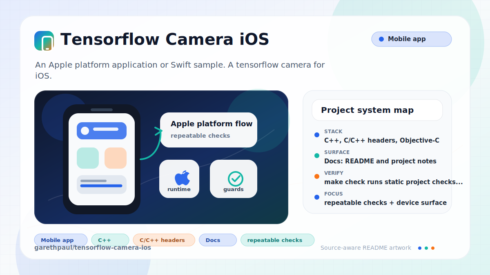

# tensorflow-camera-ios

<!-- README-OVERVIEW-IMAGE -->


## Overview

`garethpaul/tensorflow-camera-ios` is an Apple platform application or Swift sample. A tensorflow camera for iOS.

This README is based on the checked-in source, manifests, scripts, and repository metadata on the `master` branch. The project language mix found during review was: C++ (142), C/C++ headers (107), Objective-C (1), Objective-C++ (1).

## Repository Contents

- `README.md` - project overview and local usage notes
- `BUILD` - legacy TensorFlow/Bazel build metadata
- `CHANGES.md` - maintenance history for camera lifecycle checks
- `Makefile` - local verification entry points
- `app` - source or example code
- `docs/plans` - completed maintenance plans for the current baseline
- `plans` - historical implementation notes
- `scripts` - static iOS project and camera behavior validators
- `SECURITY.md` - security reporting and disclosure guidance
- `VISION.md` - project direction and maintenance guardrails

Additional scan context:

- Source directories: app
- Dependency and build manifests: none detected
- Entry points or build surfaces: none detected
- Test-looking files: app/common_runtime/constant_folding_test.cc, app/common_runtime/device_set_test.cc, app/common_runtime/direct_session_test.cc, app/common_runtime/direct_session_with_tracking_alloc_test.cc, app/common_runtime/function_test.cc, app/common_runtime/gpu/gpu_allocator_retry_test.cc, app/common_runtime/gpu/gpu_bfc_allocator_test.cc, app/common_runtime/gpu/gpu_debug_allocator_test.cc, and 4 more

## Getting Started

### Prerequisites

- Git
- macOS with Xcode for building Apple platform projects
- Python 3 for repository source checks

### Setup

```bash
git clone https://github.com/garethpaul/tensorflow-camera-ios.git
cd tensorflow-camera-ios
```

The setup commands above are derived from repository files. Legacy mobile, Python, or JavaScript samples may require older SDKs or package versions than a modern workstation uses by default.

## Running or Using the Project

- Open `app/tensorflow_camera.xcodeproj` in Xcode and run the
  `tensorflow_camera` target on an iOS device or simulator with camera support.

## Testing and Verification

- `make check` runs static project checks and camera lifecycle source checks.
  These checks cover camera permission metadata, KVO teardown, capture setup
  crash paths, pixel-buffer lock/unlock handling, and model output/label bounds.
  Frame preprocessing checks also preserve source `x`/`y` coordinate mapping
  and `CVPixelBuffer` row-stride addressing. The checks guard missing model or
  label assets from becoming fatal launch crashes, including the shared
  bundle-resource lookup used by plain and memory-mapped model loading. When
  `xcodebuild` is installed, the `build` target also attempts an iOS simulator
  build with code signing disabled.
- Static project checks also require completed canonical plans under `docs/plans`.
- Xcode's test action or `xcodebuild test` with the appropriate scheme and
  destination can be used on macOS for deeper verification.

When the required SDK or runtime is unavailable, use static checks and source review first, then verify on a machine that has the matching platform toolchain.

## Configuration and Secrets

- No required secret or credential file was identified in the repository scan. If you add integrations later, keep secrets out of git.

## Security and Privacy Notes

- Review changes touching authentication or token handling; examples from the scan include app/CameraExampleViewController.h, app/CameraExampleViewController.mm, app/common_runtime/constant_folding.cc, app/common_runtime/costmodel_manager.h, and 6 more.
- Review changes touching network requests, sockets, or service endpoints; examples from the scan include app/CameraExampleAppDelegate.h, app/CameraExampleAppDelegate.m, app/CameraExampleViewController.h, app/CameraExampleViewController.mm, and 6 more.
- Review changes touching mobile permissions or privacy-sensitive device data; examples from the scan include app/CameraExampleAppDelegate.h, app/CameraExampleAppDelegate.m, app/CameraExampleViewController.h, app/CameraExampleViewController.mm, and 6 more.
- Review changes touching file, media, JSON, XML, CSV, OCR, or data parsing; examples from the scan include app/Info.plist, app/common_runtime/gpu/gpu_device.cc, app/common_runtime/step_stats_collector.cc, app/common_runtime/sycl/sycl_device.cc, and 6 more.
- Review changes touching shell execution, subprocess, or dynamic evaluation; examples from the scan include app/debug/debug_grpc_io_utils_test.cc, app/distributed_runtime/rpc/grpc_testlib.cc, app/distributed_runtime/rpc/grpc_testlib.h.
- Review changes touching database, model, or persistence code; examples from the scan include app/CameraExampleViewController.mm, app/common_runtime/costmodel_manager.cc, app/common_runtime/device.h, app/common_runtime/device_set.h, and 6 more.

## Maintenance Notes

- This looks like an Apple platform project or sample. Xcode, Swift, CocoaPods, and deployment target versions may need to match the original project era.
- See `SECURITY.md` for vulnerability reporting and safe research guidance.
- See `VISION.md` for project direction and contribution guardrails.
- See `docs/plans/2026-06-08-tensorflow-camera-ios-baseline.md` for the
  canonical camera lifecycle baseline.
- See `docs/plans/2026-06-08-model-output-bounds.md` for the model output and
  label bounds guard.
- See `docs/plans/2026-06-08-model-load-errors.md` for the missing model/label
  asset error guard.
- See `docs/plans/2026-06-09-nonfatal-resource-lookup.md` for the shared
  bundle-resource lookup guard.
- See `docs/plans/2026-06-09-frame-preprocessing-stride.md` for the camera
  frame coordinate and row-stride guard.

## Contributing

Keep changes small and tied to the project that is already present in this repository. For code changes, document the toolchain used, avoid committing generated dependency directories or local configuration, and update this README when setup or verification steps change.
